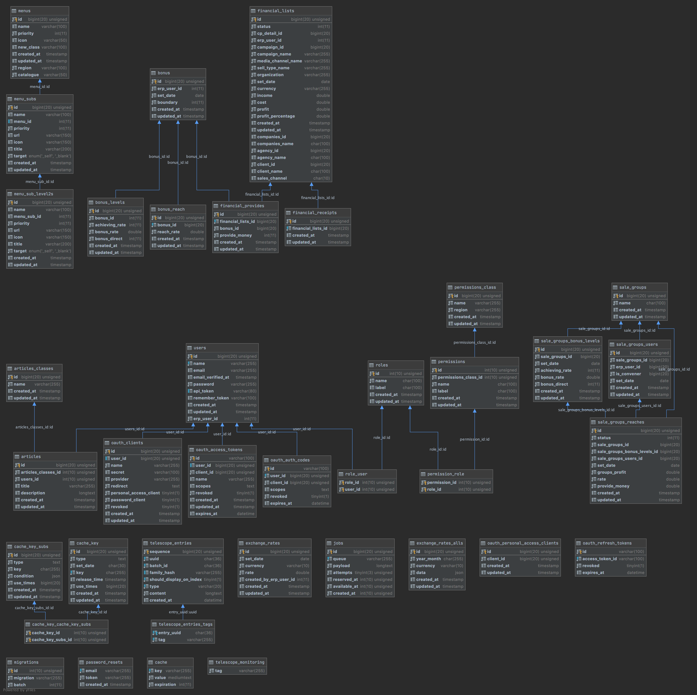

# 資料庫

<a target='_blank' href='./src/database_relationship.png'>另開圖片連結檢視</a>

___

## table關係說明
  以下簡述各table之主從關係,詳細欄位資訊 請參考程式碼內 `database/migrations` 對應table 有詳細欄位說明與型態,不另做贅述. 
   
  以下說明順序,依照圖片由左至右上至下 

---

### menus 側邊選單
   ##### relationship:
   * menus_subs : 子選單
   * menu_sub_level2s : 2級選單
   
---
### bonus 責任額
   * bonus_levels : 獎金級距
   * bonus_reach : 每個月user達標級距計算資料
   * financial_provides :  已發放獎金資料

---

### financial_list 財報資料
   資料對應 erp內media_accounting財報,以下簡稱fin
    
   ##### relationship:
   * companies  : 媒體經銷公司
   * agency : 代理商公司
   * client : 直客公司
   * financial_receipts : erp收款確認資料
   * financial_provides : 已發放獎金資料 
   * users : user資料,對應key 為 erp_user_id
   
---
### ~~articles~~
### ~~articles_classes~~
    該表已棄用
---
以下資料為 使用 laravel passport 做api認證使用
### oauth_personal_access_clients
### oauth_auth_codes
### oauth_clients
   參考 [laravel Passport](https://laravel.com/docs/8.x/passport)

---

### users 資料表
### role_user : user擁有的角色表
### roles : 角色表

---
### permission_role : 角色擁有的權限表
### permissions : 權限
### permission_class : 權限分類 

---
### sale_groups 團隊
   ##### relationship:
   * sale_groups_users : 團隊內成員設定
   * sale_groups_bonus_levels : 團隊獎金級距
   * sale_groups_reaches : 招集人達標獎金計算資料與發放狀態

---

### cache_key 快取資料
   減少系統內大量運算時間,使用快取資料表來關聯各項資料,用來控制資料是否需要releases
### cache_key_subs 快取資料 子資料
### cache_key_cache_key_subs cache and subs mapping table

---
以下資料為使用 laravel telescope dashboard 監控系統
### telescope_entries
### telescope_entries_tags
 參考 [laravel telescope](https://laravel.com/docs/8.x/telescope)

---
### exchange_rates 單日匯率資料
### exchange_rates_alls 單月匯率資料

---
### job 排程隊列 
   參考 [laravel Queues](https://laravel.com/docs/8.x/queues#dispatching-jobs)