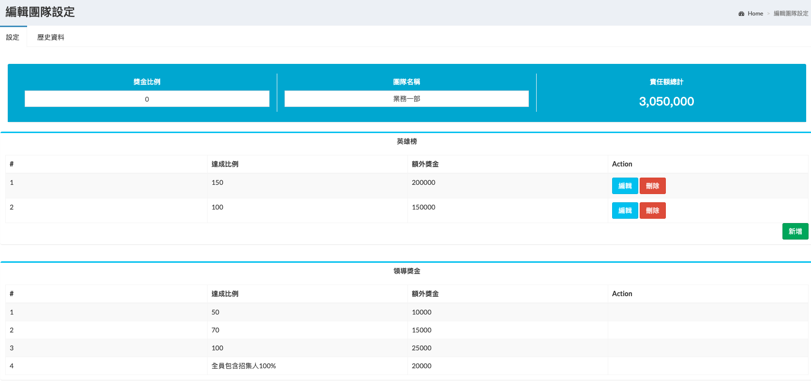
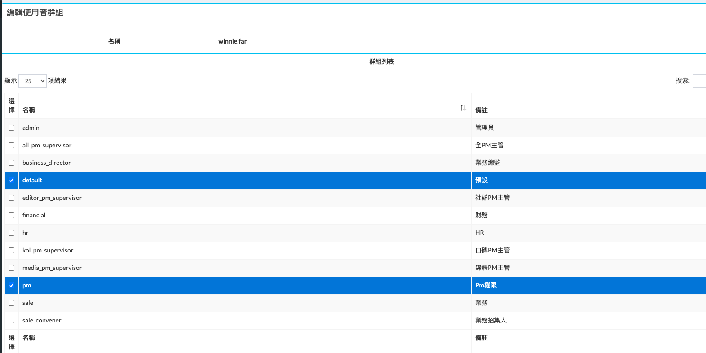

#ui各項操作
`責任額,招集人,menu,權限`

## 責任額


* 責任額 設定主要是提供獎金計算達標依據 依照user每月業績毛利去計算百分比
* 達成比例 達成比例 用來決定 獎金比例級距
* 獎金比例 毛利*獎金比例 為該user 可領獎金
* 額外獎金(英雄榜) 額外獎金 並沒有透過系統發放,業務大會人工發放 故此項計算只提供 前端畫面顯示

如果有新進業務, 需要手動設定新的條件, 每月資料系統自動更新沿用上用資料, 畫面上可設定資料為當月<br>

## 招集人(團隊獎金設定)


* 獎金比例 自行手動輸入 原則上 一個招集人 開始為 5.25% 多加一個人減去 0.25 (目前只有業務5部 業務6部 採用這個機制 其他部門設定為0即可)
* 責任額總計 系統自動帶入團隊內人員責任額
* 英雄榜 同個人責任額相同 
* 領導獎金 這部分暫時使用hardcode 的方式寫入 可參考 `dataanalysiscontrol/config/sale_group.php` 檔案內說明(僅設定業務 1 2 3 部)


* 人員清單 勾選團隊成員 一個團隊只能有一個招集人

## 權限設定


* 權限Class 目前僅用來做 權限分類使用


* 分類 對應class
* 權限 設定的keyName 對應 系統內 確認權限使用 example： `auth()->user()->hasPermission('bonus.review.editor_all_pm')`

這個頁面為全動態, 輸入新增刪除都是即時 謹慎刪除

## 角色權限設定


* 名稱 keyName 對應系統內 確認是否有該角色 example: `auth()->user()->hasRole('admin');`

## user 角色權限


* 角色 所有人都有預設權限, 其他就依照user屬性分配即可

## Menu 設定


* 主選單 右上角新增, 為新增一個分類選單
    * priority ui顯示時的排序
    * icon 選單前方顯示的 icon 可以參考連結內 adminlte 可使用的icon
    * region user 與 system 該選單出現的範圍
    * catalogue 影響在該頁面menu ui 是否會正確打開 參考 route 內 prefix('bonus/setting') 相同在該頁面
    以上的設定 都不太重要 設定錯也沒關係
* 子選單
    相同的內容就不在贅述
    * url 這邊需要設定對應 route 內的 name
        ```Route::get('/view', 'ReviewController@view')->name('bonus.review.view');```
        假設要設定一個menu 連到 業績查詢頁面 該欄的url 要設定為 bonus.review.view


